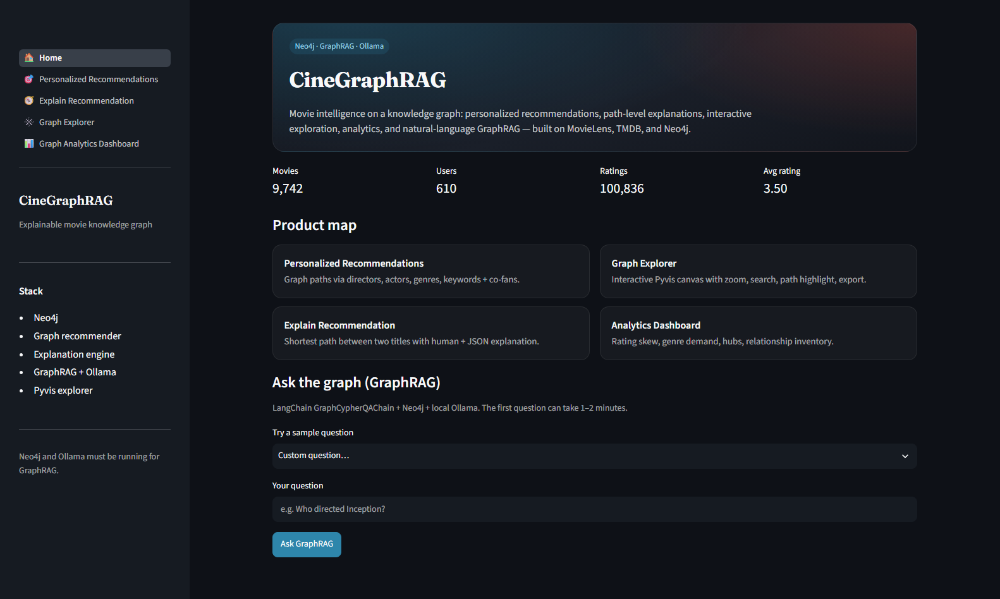
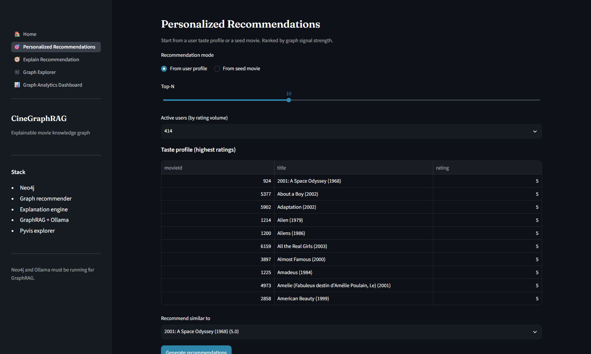
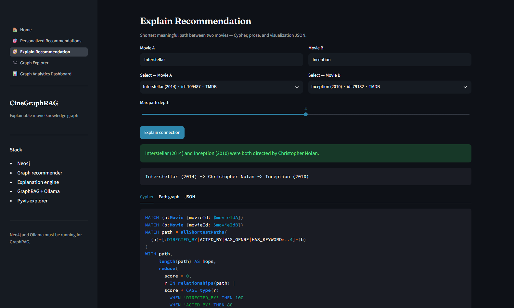
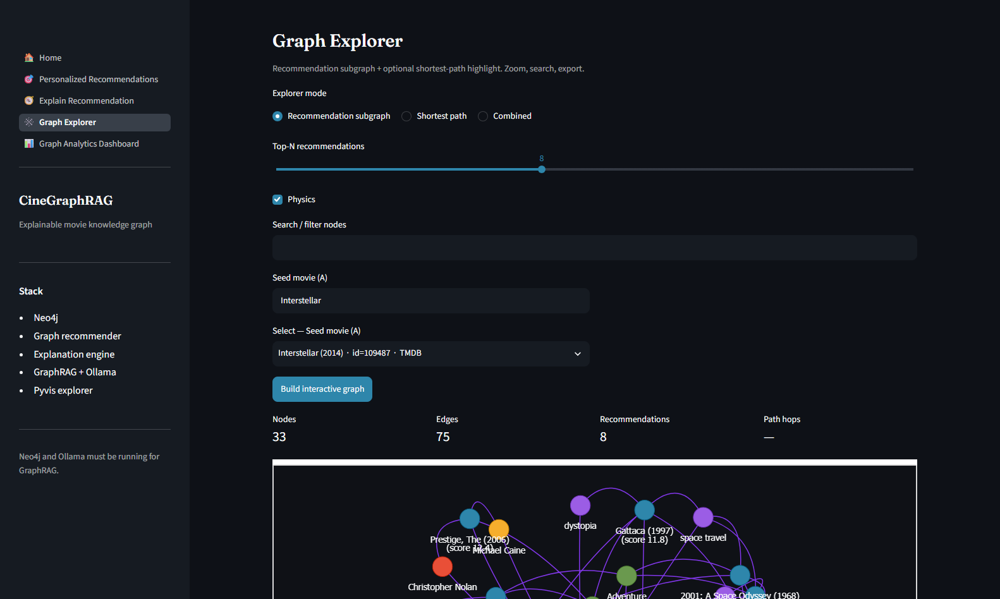
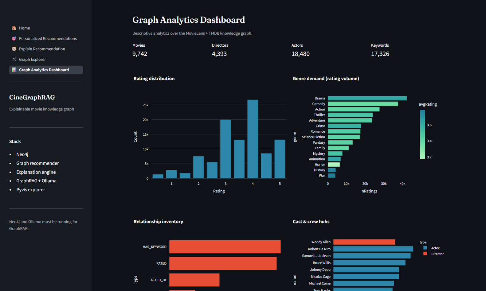
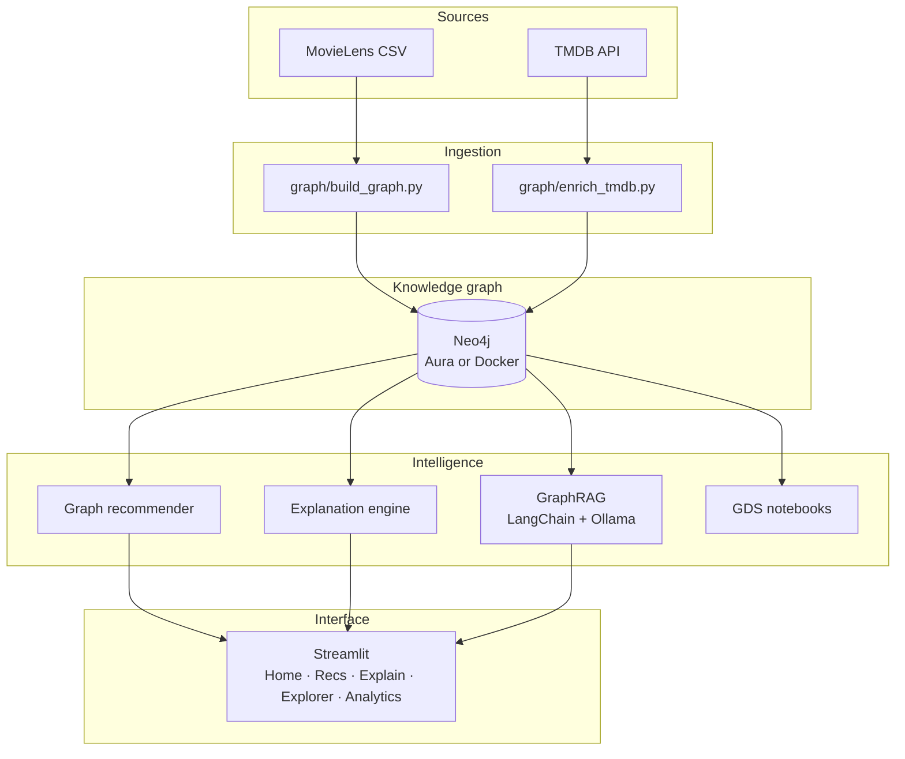

# CineGraphRAG

### Explainable movie intelligence on a knowledge graph

[](https://www.python.org/)
[](https://neo4j.com/)
[](https://www.langchain.com/)
[](https://streamlit.io/)
[](https://ollama.com/)
[](https://www.docker.com/)

**CineGraphRAG** turns [MovieLens](https://grouplens.org/datasets/movielens/) ratings and [TMDB](https://www.themoviedb.org/) metadata into a queryable knowledge graph, then layers recommendations, path-level explanations, graph analytics, and conversational GraphRAG on top.

Ask *what to watch* — and inspect *why* the graph thinks so.

<p align="center">
  
</p>

<p align="center"><sub>Home — catalog KPIs and natural-language GraphRAG over Neo4j.</sub></p>

---

## Table of contents

- [What it does](#what-it-does)
- [Product tour](#product-tour)
- [Why GraphRAG](#why-graphrag)
- [Architecture](#architecture)
- [Tech stack](#tech-stack)
- [Data model](#data-model)
- [Quick start](#quick-start)
- [Usage](#usage)
- [Notebooks](#notebooks)
- [Insights](#insights)
- [Repository layout](#repository-layout)
- [License](#license)

---

## What it does

| Layer | Role |
|---|---|
| **Ingest** | Load users, movies, and `RATED` edges into Neo4j |
| **Enrich** | Attach genres, directors, actors, and keywords from TMDB |
| **Recommend** | Rank titles from shared directors, cast, genres, keywords, and co-fans |
| **Explain** | Return the shortest *meaningful* path between two movies |
| **Ask** | Generate Cypher from a question, run it on Neo4j, verbalize the evidence |
| **Explore** | Interactive Pyvis subgraph with search, path highlight, and export |
| **Analyze** | Degree, PageRank, node similarity, and Louvain via Neo4j GDS |

Primary dataset: **MovieLens Latest Small** (~100k ratings). Enrichment: **TMDB API**.

---

## Product tour

<table>
  <tr>
    <td width="50%">
      
      <p><b>Recommendations</b><br/>Start from a user profile or a seed title. Ranked by graph signal strength.</p>
    </td>
    <td width="50%">
      
      <p><b>Explain</b><br/><code>Interstellar → Christopher Nolan → Inception</code>, plus the Cypher that found it.</p>
    </td>
  </tr>
  <tr>
    <td width="50%">
      
      <p><b>Explorer</b><br/>Recommendation neighborhood with zoom, physics, and HTML / PNG / JSON export.</p>
    </td>
    <td width="50%">
      
      <p><b>Analytics</b><br/>Rating skew, genre demand, relationship inventory, and cast/crew hubs.</p>
    </td>
  </tr>
</table>

---

## Why GraphRAG

Chunk-and-embed RAG is strong on prose. It is weaker when the answer lives in **relationships**.

| Question | Vector RAG | This project |
|---|---|---|
| Summarize a plot | Strong | Not the focus |
| Movies like *Interstellar* **because of Nolan** | Implicit at best | Native path `Movie → Director ← Movie` |
| Shared actors between two titles | Unreliable | Explicit `ACTED_BY` traversal |
| Why was this recommended? | Opaque similarity | Ranked signals + shortest path |

The LLM does not invent the catalog. It **writes Cypher**, Neo4j returns grounded rows, and the model turns that context into an answer.

```text
Question
   → schema-aware Cypher (few-shot)
   → Neo4j (read-only facts)
   → natural-language answer
```

---

## Architecture



**Runtimes**

- **Neo4j (Aura or Docker)**
- **Docker adds GDS + APOC**
- Local `uv` against Docker Neo4j (`bolt://localhost:7687`) or Neo4j Aura
- Full stack: Docker Compose (`neo4j` + `ollama` + Streamlit)

---

## Tech stack

| Layer | Tools |
|---|---|
| Language | Python 3.11+ |
| Data | Pandas, Plotly, scikit-learn |
| Graph | Neo4j 5 (Aura or Community Docker) |
| Orchestration | LangChain, `langchain-neo4j`, `langchain-ollama` |
| Local LLM | Ollama (`llama3.2:3b`, `qwen3:8b`, …) |
| Metadata | TMDB REST API |
| Visualization | Pyvis, NetworkX, Matplotlib, Plotly |
| UI | Streamlit |
| Packaging | `uv`, Docker Compose |

---

## Data model

```text
(User)-[:RATED {rating, timestamp}]->(Movie)
(Movie)-[:HAS_GENRE]->(Genre)
(Movie)-[:DIRECTED_BY]->(Director)
(Movie)-[:ACTED_BY {character, order}]->(Actor)
(Movie)-[:HAS_KEYWORD]->(Keyword)
```

Loaders are **idempotent** (`MERGE` + uniqueness constraints). TMDB enrichment skips movies already marked `tmdbEnriched=true`.

---

## Quick start

### Option A — Docker

Full walkthrough: [`docs/DOCKER.md`](docs/DOCKER.md)

```bash
cp .env.example .env          # add TMDB_API_KEY if you will enrich
docker compose up --build -d

docker compose exec app python graph/build_graph.py \
  --data-dir data/raw/ml-latest-small/ml-latest-small
```

Open **http://localhost:8501**

Windows:

```powershell
.\scripts\docker_bootstrap.ps1
```

### Option B — Local `uv` + Neo4j

Needs Python 3.11+, [`uv`](https://github.com/astral-sh/uv), Neo4j (Docker or Aura), [Ollama](https://ollama.com/), and MovieLens Latest Small under `data/raw/ml-latest-small/ml-latest-small/`.

```bash
uv sync
cp .env.example .env          # set NEO4J_*, TMDB_API_KEY, OLLAMA_*

uv run python graph/build_graph.py
uv run python graph/enrich_tmdb.py --limit 50
uv run streamlit run app/streamlit_app.py
```

The Ollama model in `.env` must exist locally. If you only pulled the Compose default:

```bash
docker compose exec ollama ollama list
# then either:  ollama pull qwen3:8b
# or set        OLLAMA_MODEL=llama3.2:3b
```

---

## Usage

### Streamlit

```bash
uv run streamlit run app/streamlit_app.py
```

| Page | Purpose |
|---|---|
| Home | Catalog KPIs + GraphRAG |
| Personalized Recommendations | User profile or seed-movie ranking |
| Explain Recommendation | Shortest path, Cypher, and JSON |
| Graph Explorer | Interactive subgraph + export |
| Graph Analytics Dashboard | Distributions and hubs |

### CLI

```bash
uv run python recommender/graph_recommender.py --title "Matrix" --limit 5

uv run python recommender/explanation_engine.py \
  --title-a "Interstellar" --title-b "Inception"

uv run python rag/graph_rag.py -q "Which genres does Toy Story belong to?" --verbose
```

Example explanation:

```text
Path: Interstellar (2014) -> Christopher Nolan -> Inception (2010)
Interstellar and Inception were both directed by Christopher Nolan.
```

Curated Browser queries: [`docs/graph_eda_cypher.md`](docs/graph_eda_cypher.md)

---

## Notebooks

| Notebook | Contents |
|---|---|
| [`01_eda_ml_latest_small.ipynb`](notebooks/01_eda_ml_latest_small.ipynb) | EDA on Latest Small |
| [`02_eda_ml_25m.ipynb`](notebooks/02_eda_ml_25m.ipynb) | Scale checks on MovieLens 25M |
| [`03_baseline_recommenders.ipynb`](notebooks/03_baseline_recommenders.ipynb) | Popularity, user-CF, item-CF |
| [`04_graph_analytics.ipynb`](notebooks/04_graph_analytics.ipynb) | GDS: degree, PageRank, similarity, Louvain |

Notebook 04 needs **Graph Data Science**. Aura Free does not include GDS — point `.env` at the local Docker Bolt URI.

---

## Insights

From EDA and baselines on Latest Small:

- The user–movie matrix is extremely sparse (about 98% empty)
- A small head of titles absorbs most ratings (long-tail catalog)
- Item-CF and popularity are strong baselines; raw user-CF is brittle
- Shared director / cast / keyword paths recover neighbors that pure CF cannot explain

GraphRAG is inspected qualitatively: the generated Cypher and returned rows must support the answer (visible in the UI and via `--verbose`).

---

## Repository layout

```text
cine-graph-rag/
├── app/
│   ├── streamlit_app.py          # Product UI
│   ├── graph_visualization.py    # Pyvis explorer
│   └── services.py               # Neo4j / analytics / RAG helpers
├── graph/
│   ├── build_graph.py            # MovieLens → Neo4j
│   ├── enrich_tmdb.py            # TMDB enrichment
│   └── neo4j_config.py           # Connection helpers
├── recommender/
│   ├── graph_recommender.py      # Multi-signal ranking
│   └── explanation_engine.py     # Shortest-path explanations
├── rag/
│   └── graph_rag.py              # GraphCypherQAChain + Ollama
├── notebooks/
│   ├── 01_eda_ml_latest_small.ipynb
│   ├── 02_eda_ml_25m.ipynb
│   ├── 03_baseline_recommenders.ipynb
│   └── 04_graph_analytics.ipynb
├── docs/
│   ├── DOCKER.md
│   ├── graph_eda_cypher.md
│   └── assets/                   # UI screenshots
├── scripts/
├── docker-compose.yml
├── pyproject.toml
└── .env.example
```

---

## License

This repository is provided for educational and research use. MovieLens and TMDB remain subject to their own terms and attribution requirements.

---

<p align="center">
  <b>CineGraphRAG</b> — from ratings to reasoned recommendations.
</p>
